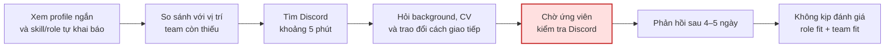
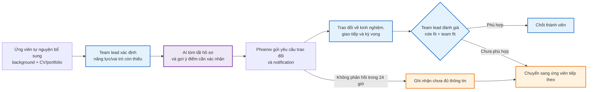
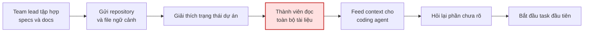
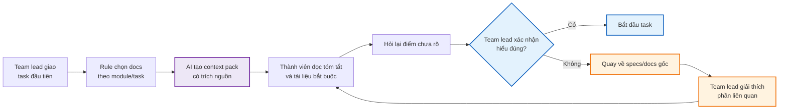
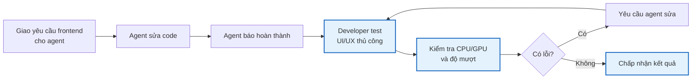
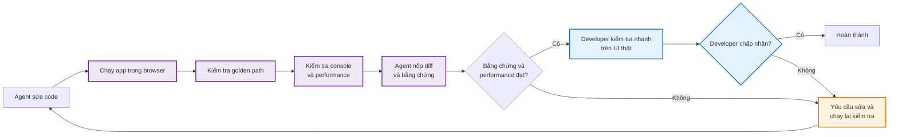

# Individual Problem Scan — Day 02

## 1. Scan rộng

Tôi bắt đầu từ các vấn đề mình đã trực tiếp gặp khi học tập, làm team lead và xây dựng nhiều dự án phần mềm song song. AI được dùng sau bước tự nhớ lại trải nghiệm để gợi ý cách diễn đạt và đặt câu hỏi làm rõ; tôi chỉ giữ những vấn đề mình đã thực sự gặp.

| # | Lăng kính | Problem quan sát được | Ai chịu ảnh hưởng? | Dấu hiệu thật |
|---|---|---|---|---|
| 1 | Tốn thời gian; pain từ người khác | Khi chọn thành viên trên Phoenix Agent Platform, team lead không thể đánh giá đầy đủ role fit và team fit từ profile ngắn cùng skill/role tự khai báo, nên phải liên hệ qua Discord để xác nhận thêm nhưng thường nhận phản hồi quá muộn. | Team lead và ứng viên | Tôi liên hệ 3 ứng viên để hỏi thêm background, CV, cách giao tiếp và mức phù hợp với các vị trí team còn thiếu; mất khoảng 5 phút để tìm tài khoản Discord. Tôi nhắn trước hạn chốt team 2–3 ngày nhưng họ phản hồi sau 4–5 ngày, khi deadline đã qua, nên tôi không tuyển được ai. |
| 2 | Lặp lại; tốn thời gian | Team lead phải chủ động hỏi tiến độ vì trạng thái công việc của các thành viên không được cập nhật đồng bộ. | Team lead và thành viên nhóm | Tôi hỏi tiến độ qua Discord 2 lần/tuần, vào đầu tuần và giữa tuần. Có lần bạn A đã hoàn thành Module 1 nhưng bạn B chưa hoàn thành phần phụ thuộc, làm tiến độ chung bị chững lại. |
| 3 | Tốn thời gian; AI có thể hỗ trợ tốt hơn | Khi thành viên mới tham gia nhóm làm đồ án hoặc bài tập lớn, họ phải đọc nhiều specs, docs và file ngữ cảnh trước khi bắt đầu task đầu tiên. | Team lead và thành viên mới | Tôi phải gửi toàn bộ specs, docs và các file Markdown chứa ngữ cảnh do coding agent tạo. Việc bàn giao đôi khi mất cả ngày; thành viên mới thường cần 1–2 ngày để bắt kịp tiến độ. |
| 4 | Tốn thời gian; AI có thể hỗ trợ tốt hơn | Sau khi AI coding agent báo hoàn thành frontend, developer vẫn phải kiểm thử thủ công UI/UX, hiệu năng và bug tiềm ẩn vì báo cáo của agent chưa đủ chứng minh tính năng hoạt động đúng. | Developer sử dụng AI coding agent | Khi làm website mạng xã hội dùng Liquid Glass, agent tạo effect lặp vô hạn, tiêu thụ nhiều CPU/GPU và gây giật lag. Tôi thường mất vài chục phút đến khoảng 1 giờ để kiểm tra lại. |
| 5 | Lặp lại; pain cá nhân | Khi làm song song nhiều dự án web có cả frontend và backend, developer khó xác định terminal, dev server và port nào còn cần thiết. | Developer làm nhiều dự án song song | Nhiều port được mở cùng lúc; tôi phải nhờ coding agent scan port và xác định process không còn dùng. Mỗi lần dọn mất khoảng 10–30 phút và xảy ra thường xuyên. |
| 6 | AI có thể hỗ trợ tốt hơn; tốn thời gian | Khi chia một project gồm nhiều phần phụ thuộc nhau, team lead có thể giao task riêng lẻ mà chưa tính thứ tự tích hợp giữa ML, web và report, khiến các phần không thể hoàn thành đúng nhịp. | Team lead và toàn bộ thành viên nhóm | Cách đây 3 tháng, trong một project môn học gồm ML, web và report, tôi chia task chưa tính dependency giữa các phần. Cả nhóm bị ảnh hưởng và nhiều task phải làm gấp sát deadline mới hoàn thành. |
| 7 | Lặp lại; pain từ người khác | Sau buổi họp nhóm, action item không ghi rõ người phụ trách và blocker không có người theo dõi có thể khiến mọi người tưởng người khác sẽ xử lý, làm task phụ thuộc bị chững lại. | Toàn bộ thành viên nhóm | Tôi từng gặp cả hai tình huống: action item sau họp không rõ owner và blocker đã được nêu nhưng không có người tiếp tục xử lý. Vấn đề thường chỉ được phát hiện ở lần check-in sau, làm chậm khoảng 1–2 ngày; task phụ thuộc không thể bắt đầu, nhiều thành viên phải chờ và cuối cùng phải làm gấp sát deadline. |
| 8 | AI có thể hỗ trợ tốt hơn; tốn thời gian | Khi làm project AI, sinh viên phải tìm và so sánh tài liệu AWS/SageMaker từ nhiều nguồn nhưng khó xác định tài liệu nào còn phù hợp và nên đọc nguồn nào trước. | Sinh viên làm project AI | Tôi từng gặp tài liệu hoặc giao diện phiên bản cũ, blog hướng dẫn khác với tài liệu AWS chính thức và không biết nên đọc tài liệu nào trước trong nhiều kết quả tìm kiếm. Với một task AWS/SageMaker mới, tôi thường mất khoảng 1–2 giờ để tìm và so sánh tài liệu trước khi biết hướng triển khai. |
| 9 | Lặp lại; tốn thời gian | Khi dùng AWS SageMaker, sinh viên phải kiểm tra nhiều màn hình, region và loại resource để tìm pipeline, endpoint hoặc job, nên dễ nhầm region hoặc không biết resource nằm ở đâu. | Sinh viên mới dùng AWS SageMaker | Tôi từng phải chuyển qua nhiều region và màn hình để tìm resource, mỗi lần mất dưới 15 phút; resource không được nhận diện hoặc tắt kịp thời từng làm phát sinh chi phí AWS ngoài dự kiến dưới 5 USD. |
| 10 | Tốn thời gian; lặp lại | Khi xếp lịch học, sinh viên phải so sánh thủ công nhiều lớp, tiết, tuần học và xung đột, đặc biệt khi muốn dồn lịch vào ít ngày nhưng một số môn chỉ có một lớp khả dụng. | Sinh viên đăng ký môn học | Tôi thường mất khoảng 30–60 phút mỗi kỳ để thử nhiều tổ hợp. Khi xếp lịch cho Hệ thống số và Học máy, tôi không thể dồn lịch vào số ngày mong muốn; môn Học máy chỉ có lớp CC02 khả dụng nên làm hỏng các phương án lịch khác. |

## 2. Chọn Top 3

Tôi xếp hạng theo mức ảnh hưởng đã quan sát được: khả năng hình thành team, thời gian onboarding bị mất, rồi đến thời gian và rủi ro khi nghiệm thu code do AI tạo.

| Rank | Problem | Vì sao chọn | Điều còn chưa chắc |
|---|---|---|---|
| 1 | Sàng lọc ứng viên trên Phoenix | Lần gần nhất tôi không kịp xác nhận background, CV, cách giao tiếp và mức phù hợp của cả 3 ứng viên trước deadline, ảnh hưởng trực tiếp đến khả năng hình thành team có cơ cấu vai trò cân bằng. | Pain có phổ biến với các team lead khác không; thông tin profile và workflow liên hệ tốt hơn có giúp hoàn thành đánh giá sơ bộ chậm nhất 24 giờ trước deadline không. |
| 2 | Onboarding thành viên mới | Mỗi thành viên mới có thể mất 1–2 ngày mới bắt đầu task đầu tiên, đồng thời team lead phải bàn giao nhiều tài liệu và ngữ cảnh. | Mục tiêu bắt đầu task trong dưới 4 giờ có khả thi không; phần chậm nhất là đọc tài liệu, hiểu kiến trúc hay thiết lập coding agent. |
| 3 | Xác minh kết quả AI coding agent | Xảy ra thường xuyên, mất 30–60 phút mỗi lần và có thể bỏ sót lỗi UI/UX hoặc hiệu năng dù agent đã báo hoàn thành. | Workflow kiểm tra tự động có phát hiện đáng tin cậy lỗi hình ảnh, trải nghiệm và tài nguyên hay không; mục tiêu dưới 15 phút có khả thi không. |

---

## 3. Problem Card #1 — Sàng lọc ứng viên trên Phoenix

**Problem 1 câu:**
Trong giai đoạn chọn team trên Phoenix Agent Platform, team lead không thể đánh giá đầy đủ mức phù hợp của ứng viên chỉ từ profile ngắn và skill/role tự khai báo. Team lead phải liên hệ qua Discord để xác nhận background, CV, cách giao tiếp, role fit và team fit, nhưng ứng viên phản hồi sau deadline nên team không kịp tuyển người phù hợp và cân bằng các vai trò còn thiếu.

**Actor:**
Team lead đang sàng lọc thành viên cho team build; ứng viên đã đăng ký tham gia chương trình.

**Thời điểm / bối cảnh:**
Giai đoạn chọn thành viên, khi chỉ còn 2–3 ngày trước thời hạn chốt team và team cần xác định người phù hợp với các vị trí còn thiếu như BA, PM, Developer hoặc AI Engineer.

**Current workflow 6 bước:**

1. Team lead xem profile ngắn, skill và role do ứng viên tự chọn trên Phoenix.
2. So sánh thông tin ban đầu với các vai trò và năng lực team còn thiếu.
3. Tìm tài khoản Discord của từng ứng viên từ tên trong danh sách.
4. Nhắn hỏi thêm background, CV, kinh nghiệm và trao đổi để quan sát cách giao tiếp.
5. Chờ ứng viên đọc và phản hồi.
6. Đánh giá sơ bộ role fit và team fit trước deadline hoặc chuyển sang ứng viên khác.

**Bottleneck:**
Profile ngắn cùng skill/role tự khai báo chưa đủ để đánh giá role fit và team fit. Team lead phải xác nhận thêm qua trao đổi trực tiếp, nhưng một số ứng viên ít hoạt động trên Discord nên phản hồi sau deadline. Role không phải điều kiện tiên quyết duy nhất; cách giao tiếp và ứng xử với team cũng cần được đánh giá.

**Impact:**

- Tôi liên hệ 3 ứng viên để hỏi thêm thông tin nhưng không kịp đánh giá người nào trước deadline.
- Tôi nhắn trước deadline 2–3 ngày nhưng các ứng viên phản hồi sau 4–5 ngày.
- Team mất cơ hội tuyển người phù hợp và có nguy cơ mất cân bằng vai trò, ví dụ thừa Developer/AI Engineer nhưng vẫn thiếu BA hoặc PM.

**Success metric:**

- Baseline: `0/3` ứng viên hoàn thành trao đổi và được đánh giá sơ bộ trước deadline; phản hồi sau 4–5 ngày.
- Target sau challenge: có đủ thông tin để đánh giá sơ bộ role fit và team fit chậm nhất 24 giờ trước deadline chốt team.
- Cách đo: khoảng thời gian từ lúc có đủ thông tin để ghi nhận kết quả đánh giá sơ bộ đến deadline chốt team; đạt khi khoảng này từ 24 giờ trở lên.
- Guardrail: không tự động loại ứng viên chỉ dựa trên role/skill tự khai báo; không dùng kênh liên hệ hoặc dữ liệu CV khi chưa có sự đồng ý của ứng viên.

**Non-AI alternative:**

- Phoenix bổ sung các trường background, kinh nghiệm, link CV/portfolio và vai trò mong muốn do ứng viên tự nguyện cung cấp.
- Dùng bộ câu hỏi sàng lọc ngắn thống nhất cho role fit và team fit.
- Phoenix gửi notification trực tiếp và cho ứng viên tự nguyện chọn thêm kênh liên hệ.
- Hiển thị trạng thái đã liên hệ, đã phản hồi và đã đánh giá; rule nhắc lại sau một khoảng thời gian cố định.

**AI hypothesis:**
AI có thể tóm tắt profile/CV, đối chiếu thông tin với các năng lực team còn thiếu và gợi ý câu hỏi cần xác nhận. Tuy nhiên, AI không nên tự quyết định ứng viên phù hợp vì cách giao tiếp, ứng xử và team fit cần team lead đánh giá trực tiếp. Bottleneck liên lạc vẫn cần workflow/notification thay vì Agent tự động tuyển người.

**Quick gut:**

- [ ] No AI / process fix
- [ ] Rule
- [x] Workflow
- [ ] Agent
- [ ] Chưa biết

### Draft current workflow

```text
CURRENT STATE — không hoàn thành đánh giá trước deadline

[Xem profile ngắn + skill/role tự khai báo]
→ [So sánh với vị trí team còn thiếu]
→ [Tìm Discord: khoảng 5 phút]
→ [Hỏi background, CV và trao đổi cách giao tiếp]
→ [Chờ ứng viên kiểm tra Discord]  <-- bottleneck
→ [Ứng viên phản hồi sau 4–5 ngày]
→ [Không kịp đánh giá role fit + team fit]
```

#### Mermaid — Current workflow



### Draft future workflow

```text
FUTURE STATE — đủ thông tin chậm nhất 24 giờ trước deadline

[Ứng viên tự nguyện bổ sung background + CV/portfolio]
→ [Team lead xác định năng lực/vai trò team còn thiếu]
→ [AI tóm tắt hồ sơ + gợi ý điểm cần xác nhận]
→ [Phoenix gửi yêu cầu trao đổi + notification]
→ [Trao đổi trực tiếp về kinh nghiệm, giao tiếp và kỳ vọng]
→ [Team lead đánh giá role fit + team fit]  <-- human boundary
→ [Chốt hoặc chuyển sang ứng viên tiếp theo]

Fallback:
Hồ sơ thiếu hoặc không phản hồi trong 24 giờ
→ không tự động loại bằng AI
→ team lead ghi nhận chưa đủ thông tin
→ chuyển sang ứng viên tiếp theo trước deadline.
```

#### Mermaid — Future workflow



---

## 4. Problem Card #2 — Onboarding thành viên mới vào dự án

**Problem 1 câu:**
Khi một thành viên mới tham gia nhóm làm đồ án hoặc bài tập lớn, họ phải đọc nhiều specs, tài liệu và file ngữ cảnh của coding agent trước khi có thể bắt đầu làm việc, khiến quá trình onboarding kéo dài 1–2 ngày.

**Actor:**
Team lead và thành viên mới tham gia nhóm làm đồ án hoặc bài tập lớn.

**Thời điểm / bối cảnh:**
Khi dự án đã bắt đầu và có thành viên mới tham gia giữa quá trình thực hiện.

**Current workflow 7 bước:**

1. Team lead tập hợp toàn bộ specs và tài liệu dự án.
2. Team lead gửi repository và các file Markdown chứa ngữ cảnh.
3. Team lead giải thích trạng thái hiện tại của dự án.
4. Thành viên mới đọc specs, docs và lịch sử liên quan.
5. Thành viên mới chọn và cung cấp lại ngữ cảnh cho AI coding agent của mình.
6. Thành viên hỏi lại những phần chưa hiểu.
7. Thành viên bắt đầu task đầu tiên.

**Bottleneck:**
Ngữ cảnh dự án nằm trong nhiều specs, docs và file Markdown. Thành viên mới không thể đọc, chọn lọc và hiểu đủ nhanh phần thông tin liên quan trực tiếp đến task đầu tiên.

**Impact:**

- Việc gửi và giải thích tài liệu đôi khi mất gần một ngày.
- Thành viên mới thường cần 1–2 ngày để theo kịp dự án và bắt đầu task đầu tiên.
- Task đầu tiên bị trì hoãn và team lead phải dành thời gian giải thích lại.

**Success metric:**

- Baseline: thành viên mới cần 1–2 ngày để bắt đầu task đầu tiên.
- Target cần validation: bắt đầu task đầu tiên trong dưới 4 giờ làm việc.
- Cách đo: thời gian từ lúc được cấp quyền truy cập dự án đến lúc bắt đầu thực hiện task đầu tiên.
- Guardrail: thành viên vẫn phải đọc và xác nhận các yêu cầu, quyết định quan trọng liên quan trực tiếp đến task.

**Non-AI alternative:**

- Tài liệu `START-HERE` ngắn.
- Onboarding checklist và thứ tự tài liệu bắt buộc.
- Chuẩn bị task đầu tiên nhỏ, ít phụ thuộc.
- Duy trì bản tóm tắt trạng thái dự án được cập nhật thủ công.

**AI hypothesis:**
Một workflow có AI có thể tổng hợp specs và docs thành context pack theo task, trả lời câu hỏi dựa trên nguồn nội bộ và dẫn lại file gốc để thành viên kiểm tra. AI không tự thay đổi yêu cầu hoặc thay thế tài liệu gốc.

**Quick gut:**

- [ ] No AI / process fix
- [ ] Rule
- [x] Workflow
- [ ] Agent
- [ ] Chưa biết

### Draft current workflow

```text
CURRENT STATE — 1–2 ngày

[Team lead tập hợp specs/docs]
→ [Gửi repository + file ngữ cảnh]
→ [Giải thích trạng thái dự án]
→ [Thành viên đọc toàn bộ tài liệu]  <-- bottleneck
→ [Feed context cho coding agent]
→ [Hỏi lại phần chưa rõ]
→ [Bắt đầu task đầu tiên]
```

#### Mermaid — Current workflow



### Draft future workflow

```text
FUTURE STATE — target cần validation: dưới 4 giờ

[Team lead giao task đầu tiên]
→ [Rule chọn docs theo module/task]
→ [AI tạo context pack có trích nguồn]
→ [Thành viên đọc tóm tắt + tài liệu bắt buộc]
→ [Thành viên hỏi lại điểm chưa rõ]
→ [Team lead xác nhận hiểu đúng]  <-- human boundary
→ [Bắt đầu task]

Fallback:
Context pack thiếu hoặc sai
→ quay về specs/docs gốc
→ team lead giải thích phần liên quan.
```

#### Mermaid — Future workflow



---

## 5. Problem Card #3 — Xác minh kết quả của AI coding agent

**Problem 1 câu:**
Sau khi AI coding agent báo hoàn thành frontend, developer vẫn phải mất từ vài chục phút đến một giờ để kiểm thử thủ công UI/UX, hiệu năng và bug tiềm ẩn vì báo cáo hoàn thành của agent chưa đủ chứng minh tính năng hoạt động đúng.

**Actor:**
Developer sử dụng AI coding agent để xây dựng frontend cho website.

**Thời điểm / bối cảnh:**
Sau khi coding agent sửa code và báo task đã hoàn thành, trước khi developer chấp nhận kết quả.

**Current workflow 7 bước:**

1. Developer mô tả yêu cầu frontend cho coding agent.
2. Agent sửa code và chạy các kiểm tra tự động nếu có.
3. Agent báo task đã hoàn thành.
4. Developer mở website và kiểm tra UI thủ công.
5. Developer thử các luồng tương tác và trải nghiệm người dùng.
6. Developer theo dõi độ mượt và mức sử dụng CPU/GPU.
7. Nếu phát hiện lỗi, developer yêu cầu agent sửa rồi kiểm tra lại.

**Bottleneck:**
Developer phải tự kiểm chứng các claim của agent trên giao diện thật. Test và type-check không phát hiện đầy đủ lỗi animation, trải nghiệm người dùng hoặc mức tiêu thụ tài nguyên bất thường.

**Impact:**

- Mỗi lần xác minh thường mất khoảng 30–60 phút.
- Agent có thể báo hoàn thành dù giao diện vẫn có lỗi hiệu năng.
- Trong website mạng xã hội dùng Liquid Glass, agent tạo effect lặp vô hạn, làm CPU/GPU hoạt động nhiều và giao diện giật lag.
- Nếu không kiểm tra thủ công, lỗi có thể đi vào bản demo hoặc sản phẩm.

**Success metric:**

- Baseline: developer mất khoảng 30–60 phút để xác minh một lần agent báo hoàn thành.
- Target cần validation: giảm thời gian xác minh xuống dưới 15 phút.
- Quality guardrail: không chấp nhận task nếu còn animation/effect chạy vô hạn hoặc gây giật lag rõ rệt.
- Cách đo: thời gian từ lúc agent báo hoàn thành đến khi developer chấp nhận hoặc trả task để sửa.
- Human boundary: developer vẫn thực hiện kiểm tra và phê duyệt cuối trên giao diện thật.

**Non-AI alternative:**

- Checklist nghiệm thu frontend cố định.
- Browser performance profiler và kiểm tra console.
- Test các interaction quan trọng.
- Giới hạn hoặc loại bỏ animation không cần thiết.
- Yêu cầu bằng chứng như ảnh chụp, log và kết quả kiểm tra trước khi coi task hoàn thành.

**AI hypothesis:**
Một workflow xác minh có thể yêu cầu agent chạy ứng dụng, kiểm tra các luồng chính, quan sát console và performance rồi cung cấp bằng chứng. Một AI reviewer độc lập có thể đối chiếu yêu cầu với diff và bằng chứng, nhưng developer vẫn là người phê duyệt cuối.

**Quick gut:**

- [ ] No AI / process fix
- [ ] Rule
- [x] Workflow
- [ ] Agent
- [ ] Chưa biết

### Draft current workflow

```text
CURRENT STATE — 30–60 phút xác minh

[Giao yêu cầu frontend cho agent]
→ [Agent sửa code]
→ [Agent báo hoàn thành]
→ [Developer test UI/UX thủ công]  <-- bottleneck
→ [Kiểm tra CPU/GPU và độ mượt]
→ [Phát hiện effect loop vô hạn]
→ [Yêu cầu agent sửa]
→ [Test lại]
```

#### Mermaid — Current workflow



### Draft future workflow

```text
FUTURE STATE — target cần validation: dưới 15 phút

[Agent sửa code]
→ [Chạy app trong browser]
→ [Kiểm tra golden path]
→ [Kiểm tra console + performance]
→ [Agent nộp diff và bằng chứng]
→ [Developer kiểm tra nhanh trên UI thật]  <-- human boundary
→ [Chấp nhận hoặc trả lại]

Fallback:
Không có bằng chứng hoặc performance không đạt
→ task chưa được coi là hoàn thành
→ developer yêu cầu sửa và chạy lại kiểm tra.
```

#### Mermaid — Future workflow



---

## 6. Card tôi muốn pitch nhất

**Card:** Problem Card #3 — Xác minh kết quả của AI coding agent.

**Vì sao:**
Vấn đề xảy ra thường xuyên trong quá trình tôi dùng coding agent, có baseline 30–60 phút và có ví dụ thật về effect Liquid Glass lặp vô hạn gây tải CPU/GPU. Workflow cũng cho phép so sánh rõ checklist/rule, workflow có AI và Agent mà vẫn giữ developer làm người phê duyệt cuối.

**Câu hỏi tôi muốn nhóm challenge:**

> Workflow kiểm chứng nào có thể giảm thời gian test xuống dưới 15 phút mà vẫn phát hiện được lỗi UI/UX và hiệu năng vốn khó bắt bằng test tự động?

## 7. Ghi chú sử dụng AI trong phần scan

- AI giúp gợi ý cách nhóm các trải nghiệm thành candidate problems và đặt câu hỏi để làm rõ actor, workflow, thời gian và hậu quả.
- Tôi loại bỏ hoặc sửa các chi tiết AI suy đoán, chỉ giữ lại 10 vấn đề mình đã trực tiếp gặp.
- Tôi bổ sung bằng chứng từ trải nghiệm thật: 3 ứng viên phản hồi trễ, 2 lần hỏi tiến độ mỗi tuần, onboarding 1–2 ngày, kiểm tra agent 30–60 phút và dọn process 10–30 phút.
- Target Phoenix được đổi sau challenge thành có đủ thông tin chậm nhất 24 giờ trước deadline; các target `dưới 4 giờ` và `dưới 15 phút` vẫn là giả thuyết cần validation, không phải kết quả đã kiểm chứng.
