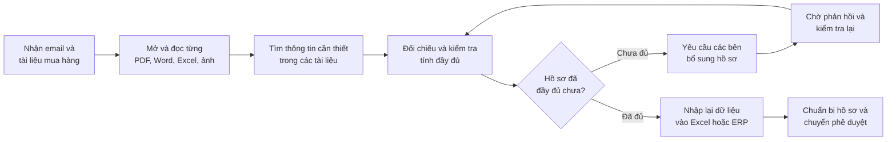
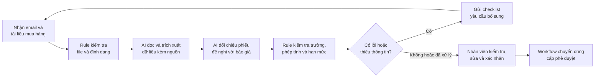

# Group Report — Day 02

## 1. Thành viên nhóm

| STT | Họ và tên | Mã học viên |
|---|---|---|
| 1 | Chu Nguyễn Tuấn Anh | 2A202601755 |
| 2 | Đào Thị Trang | 2A202601809 |
| 3 | Lê Minh Ngọc | 2A202601471 |
| 4 | Vũ Tiến Dũng | 2A202602009 |
| 5 | Nguyễn Đức Anh | 2A202601063 |

## 2. Quá trình chọn bài toán

### 2.1. Danh sách bài toán được trình bày

| # | Người đưa ra | Bài toán | Người gặp vấn đề | Điểm nghẽn | Nhận xét ban đầu |
|---|---|---|---|---|---|
| 1 | Chu Nguyễn Tuấn Anh | Sàng lọc ứng viên trên Phoenix | Trưởng nhóm và ứng viên | Hồ sơ ngắn và kỹ năng/vai trò tự khai báo chưa đủ để đánh giá; liên hệ qua Discord nhưng thường nhận phản hồi sau hạn | Có bằng chứng rõ: 0/3 ứng viên được đánh giá trước hạn; trưởng nhóm vẫn phải quyết định mức phù hợp với vị trí và đội. |
| 2 | Chu Nguyễn Tuấn Anh | Hướng dẫn thành viên mới vào dự án | Trưởng nhóm và thành viên mới | Thông tin nằm rải rác trong đặc tả, tài liệu và file Markdown; người mới phải tự chọn lọc trước nhiệm vụ đầu tiên | Hiện mất 1–2 ngày; quy trình rõ nhưng mục tiêu dưới 4 giờ chưa được kiểm chứng. |
| 3 | Chu Nguyễn Tuấn Anh | Xác minh kết quả AI coding agent | Lập trình viên dùng AI coding agent | Agent báo xong nhưng kiểm thử và kiểm tra kiểu chưa phản ánh đầy đủ giao diện, trải nghiệm và hiệu năng thực tế | Có bằng chứng rõ: mất 30–60 phút kiểm tra; từng có hiệu ứng lặp làm CPU/GPU tải cao và giao diện giật. |
| 4 | Đào Thị Trang | Tạo JD và đăng tuyển trên nhiều nền tảng | Nhân viên tuyển dụng | Chuyển yêu cầu sơ sài của quản lý tuyển dụng thành JD, chỉnh định dạng rồi đăng nhiều kênh | Hiện mất khoảng 90 phút/JD; người dùng và cách đo khá rõ. |
| 5 | Đào Thị Trang | Đọc và lọc CV theo JD | Nhân viên tuyển dụng và quản lý tuyển dụng | Đọc 30–50 CV, đối chiếu tiêu chí và ghi chú, có nguy cơ bỏ sót người phù hợp | Hiện mất khoảng 60 phút/JD; cần kiểm soát việc loại nhầm và thiên lệch. |
| 6 | Đào Thị Trang | Chuẩn bị câu hỏi phỏng vấn theo CV | Nhân viên tuyển dụng và quản lý tuyển dụng | Đọc CV, tìm điểm cần xác minh và soạn câu hỏi tình huống thay vì câu hỏi chung | Hiện mất khoảng 30 phút/ứng viên; phạm vi hẹp và quy trình rõ. |
| 7 | Lê Minh Ngọc | Xử lý yêu cầu mua sắm nội bộ | Nhân viên mua sắm/hành chính | Đọc email, hồ sơ, báo giá, kiểm tra thiếu sót rồi nhập lại dữ liệu trước phê duyệt | Con số 10–20 phút lúc trình bày chỉ là ước lượng; sau kiểm chứng, nhóm cập nhật thành 80–90 phút theo hai người trực tiếp xử lý. |
| 8 | Lê Minh Ngọc | Tổng hợp báo cáo quản lý cấp phường | Cán bộ tổng hợp báo cáo | Chuẩn hóa chỉ tiêu và kiểm tra số liệu từ Word, Excel, PDF trước khi lập báo cáo chung | Tác động có thể lớn nhưng mốc 3–4 giờ còn là giả định; cần chọn một loại báo cáo cụ thể. |
| 9 | Lê Minh Ngọc | Tra cứu quy định lao động và BHXH có dẫn nguồn | Nhân sự/C&B/pháp chế | Xác định văn bản còn hiệu lực và đối chiếu nhiều điều khoản cho cùng tình huống | Mốc 20–30 phút còn là giả định; cần nguồn chính thức và người có chuyên môn pháp lý kiểm tra. |
| 10 | Vũ Tiến Dũng | Tổng hợp yêu cầu lab từ nhiều file | Học viên mới | Chuyển qua lại README, worksheet, bài mẫu và rubric để hợp nhất yêu cầu rải rác | Hiện mất khoảng 20–30 phút; có thể kiểm chứng ngay trong lớp. |
| 11 | Vũ Tiến Dũng | Thành viên hiểu khác nhau về yêu cầu bài tập | Nhóm 3–4 học viên | Khác biệt cách hiểu chỉ lộ ra khi ghép bài gần hạn nộp | Vấn đề rõ nhưng chưa đo số lần phải sửa. |
| 12 | Vũ Tiến Dũng | Problem Statement thiếu metric và boundary | Học viên mới làm theo hướng problem-first | Khó tự phát hiện metric chưa đo được, boundary mơ hồ hoặc nhảy sang giải pháp | Phù hợp phạm vi lab; chưa rõ checklist đơn giản đã đủ hay cần AI phản biện. |
| 13 | Nguyễn Đức Anh | Gom yêu cầu và hạn nộp bài từ nhiều nguồn | Sinh viên học từ 4 môn trở lên | Đọc LMS, Discord và file hướng dẫn rồi nối các thông tin rời rạc thành danh sách việc | Khoảng 20–30 phút/tuần là ước lượng; cần giới hạn quyền truy cập dữ liệu. |
| 14 | Nguyễn Đức Anh | Kiểm tra bài nộp theo rubric | Sinh viên chuẩn bị nộp bài | Đối chiếu từng tiêu chí với vị trí bằng chứng trong bài làm | Khoảng 20 phút/lần là ước lượng; quy trình và cách đo khá rõ. |
| 15 | Nguyễn Đức Anh | Tìm quyết định cũ trong Discord | Thành viên nhóm học tập/dự án | Từ khóa nhớ được không trùng câu chữ tin nhắn nên phải mở nhiều kết quả và luồng thảo luận | Mất khoảng 5–15 phút/lần; cần lưu ý quyền truy cập và dữ liệu riêng tư. |

### 2.2. Gom các bài toán gần nhau

| Nhóm | Các bài toán | Điểm chung | Ghi chú |
|---|---|---|---|
| A — Tuyển dụng và đánh giá ứng viên | #1 Sàng lọc ứng viên Phoenix; #4 Tạo JD; #5 Lọc CV; #6 Chuẩn bị câu hỏi phỏng vấn | Xác định nhu cầu nhân sự → đọc hồ sơ → đối chiếu năng lực → trao đổi → con người quyết định | Cùng lĩnh vực tuyển dụng nhưng thuộc nhiều bước khác nhau; nếu chọn cần thu hẹp một bước. |
| B — Hiểu yêu cầu và kiểm tra bài học | #10 Tổng hợp yêu cầu lab; #11 Thành viên hiểu khác nhau; #12 Problem Statement thiếu metric/boundary; #13 Gom yêu cầu/hạn nộp; #14 Kiểm tra bài theo rubric | Đọc nhiều nguồn → rút yêu cầu → thống nhất cách hiểu → thực hiện → đối chiếu trước khi nộp | Các vấn đề gần nhau và dễ kiểm chứng trong lớp, nhưng không nên gộp lập kế hoạch với kiểm bài. |
| C — Ngữ cảnh và kiểm chứng trong phát triển phần mềm | #2 Hướng dẫn thành viên mới; #3 Xác minh AI coding agent; #15 Tìm quyết định cũ trong Discord | Thu thập ngữ cảnh hoặc bằng chứng từ nhiều nguồn → hiểu hay kiểm tra kết quả → con người xác nhận | Người dùng và đầu ra khác nhau; điểm chung chủ yếu là tìm ngữ cảnh và kiểm chứng. |
| D — Xử lý tài liệu nghiệp vụ từ nhiều nguồn | #7 Yêu cầu mua sắm nội bộ; #8 Báo cáo quản lý cấp phường; #9 Tra cứu lao động/BHXH | Nhận nhiều tài liệu → trích xuất → chuẩn hóa, đối chiếu → tạo kết quả có nguồn → người nghiệp vụ kiểm tra | Ba bài cùng cách xử lý nhưng khác lĩnh vực và mức rủi ro. Nhóm chọn nhóm này để lập danh sách rút gọn. |

**Nhóm được chọn:** D — Xử lý tài liệu nghiệp vụ từ nhiều nguồn.

### 2.3. Danh sách rút gọn

| Bài toán | Vì sao được giữ lại | Rủi ro / điều chưa rõ |
|---|---|---|
| **#7 — Xử lý yêu cầu mua sắm nội bộ** | Người dùng và quy trình rõ; điểm nghẽn nằm ở việc đọc, kiểm tra và nhập lại hồ sơ trước phê duyệt. | Hai người trực tiếp xử lý mới xác nhận thời gian ở mức sơ bộ; chưa có nhật ký từng yêu cầu, loại yêu cầu và số lượng xử lý. |
| **#8 — Tổng hợp báo cáo quản lý cấp phường** | Có quy trình nhiều bước rõ: nhận Word/Excel/PDF → chuẩn hóa chỉ tiêu → kiểm tra số liệu → lập báo cáo. | Mốc 3–4 giờ/báo cáo mới là giả định; cần chọn một loại báo cáo và phạm vi có thể quá rộng cho buổi lab. |
| **#9 — Tra cứu quy định lao động/BHXH có dẫn nguồn** | Người dùng và điểm nghẽn rõ; có thể vẽ quy trình tìm, kiểm tra hiệu lực, đối chiếu và trả lời có nguồn. | Mốc 20–30 phút/câu hỏi mới là giả định; rủi ro pháp lý cao nên bắt buộc dùng nguồn chính thức và có người chuyên môn kiểm tra. |

### 2.4. Chấm điểm để đồng thuận

| Bài toán | Người dùng rõ | Quy trình rõ | Có bằng chứng | Tác động đo được | Làm trong lab | So sánh R/W/A được | Nhóm hiểu nghiệp vụ | Tổng |
|---|---:|---:|---:|---:|---:|---:|---:|---:|
| **#7 — Xử lý yêu cầu mua sắm nội bộ** | 5 | 5 | 4 | 4 | 5 | 5 | 4 | **32** |
| **#8 — Tổng hợp báo cáo quản lý cấp phường** | 4 | 4 | 2 | 3 | 2 | 4 | 3 | **22** |
| **#9 — Tra cứu quy định lao động/BHXH** | 4 | 4 | 2 | 3 | 3 | 4 | 3 | **23** |

**Bài toán được chọn để đào sâu:** **#7 — Xử lý yêu cầu mua sắm nội bộ**, giới hạn ở bước tiếp nhận và chuẩn bị hồ sơ trước phê duyệt.

Nhóm chọn #7 vì người dùng, quy trình và điểm nghẽn đều rõ; đầu vào gồm nhiều loại tài liệu nên có thể so sánh trực tiếp form + Rule với cách có AI hỗ trợ. #8 chưa có mốc thời gian đã đo và còn rộng. #9 có rủi ro pháp lý cao, cần nguồn chính thức và người có chuyên môn kiểm tra.

## 3. Kiểm chứng nhanh

**Phạm vi kiểm chứng:** Từ lúc nhận email/tài liệu đến khi hồ sơ sẵn sàng chuyển phê duyệt. Không gồm chọn nhà cung cấp, đàm phán, ký hợp đồng, nhập kho hoặc thanh toán.

Nhóm trao đổi với **3 người**, gồm **2 người trực tiếp xử lý hồ sơ** và **1 người gửi yêu cầu**; mỗi người đã tham gia hơn 5 yêu cầu mua sắm. Hai người xử lý cho biết việc đọc và kiểm tra tài liệu thường mất khoảng 60 phút hoặc hơn, sau đó cần thêm 20–30 phút để nhập dữ liệu. Người gửi chỉ xác nhận khó khăn khi chuẩn bị hồ sơ nên không được dùng làm nguồn cho các mốc thời gian này.

| Nguồn | Số người / số mẫu | Tín hiệu xác nhận | Tín hiệu phản bác | Điều chỉnh của nhóm |
|---|---:|---|---|---|
| Trao đổi với người tham gia quy trình | 3 người: 2 người xử lý và 1 người gửi yêu cầu; mỗi người có kinh nghiệm trên 5 yêu cầu | Hai người xử lý xác nhận thời gian đọc/kiểm tra và nhập dữ liệu; người gửi xác nhận khó khăn khi chuẩn bị hồ sơ | Có ý kiến rằng form bắt buộc và checklist có thể giải quyết phần lớn vấn đề mà không cần AI | Chỉ đo thời gian thao tác trước phê duyệt; dùng form + Rule làm phương án đối chứng |
| Nghiên cứu quy trình mua sắm hiện có | 3 nguồn sản phẩm chính thức | Purchase requisition thường có trạng thái nháp, bước kiểm tra và định tuyến phê duyệt theo Rule | Việc các sản phẩm này tồn tại không chứng minh người dùng của nhóm cần AI | Dùng Rule/Workflow cho định tuyến; chỉ thử AI ở bước đọc và đối chiếu tài liệu không đồng nhất |
| Nhật ký hoặc tài liệu mẫu đã ẩn dữ liệu | Chưa có | Chưa đo được số file, số trường nhập lại hoặc tỷ lệ hồ sơ bị trả lại | Chưa thể biết AI tiết kiệm được bao nhiêu so với form + Rule | Pilot phải dùng 5–10 yêu cầu đã ẩn dữ liệu |

Ước lượng 10–20 phút lúc trình bày ban đầu không có nguồn nên nhóm loại bỏ. Mốc mới là **80–90 phút thời gian thao tác/yêu cầu**, gồm khoảng 60 phút đọc, kiểm tra và 20–30 phút nhập dữ liệu. Đây vẫn là mốc sơ bộ vì chưa có nhật ký từng yêu cầu. Mục tiêu 25 phút là tiêu chí cần kiểm chứng trong pilot, chưa phải kết quả đạt được.

Nhóm cũng ghi nhận ý kiến phản bác rằng form và checklist có thể đã đủ. Vì vậy AI chỉ được giữ lại nếu đầu vào thực tế vẫn gồm nhiều tài liệu không đồng nhất và pilot cho kết quả tốt hơn form + Rule.

**Những điểm chưa rõ:**

- Thời gian xử lý thay đổi thế nào giữa các loại yêu cầu mua sắm.
- Mỗi tuần hoặc tháng có bao nhiêu yêu cầu.
- Trung bình một yêu cầu có bao nhiêu file và bao nhiêu trường phải nhập lại.
- Tỷ lệ hồ sơ thiếu, mâu thuẫn hoặc bị người phê duyệt trả lại.
- Form chuẩn và Rule giải quyết được bao nhiêu phần trăm vấn đề.
- Tài liệu nội bộ có được phép xử lý bằng dịch vụ AI đám mây hay phải dùng môi trường riêng.

## 4. Nghiên cứu giải pháp hiện có

| Nguồn | Liên kết | Phần được giải quyết | Điểm mạnh | Khoảng trống / rủi ro | Bài học cho nhóm |
|---|---|---|---|---|---|
| Microsoft Dynamics 365 — Purchase requisition workflow | [Microsoft Learn](https://learn.microsoft.com/en-us/dynamics365/supply-chain/procurement/purchase-requisitions-workflow) | Chuyển yêu cầu mua sắm từ bản nháp qua kiểm tra đến phê duyệt và định tuyến theo điều kiện | Vai trò, trạng thái và quy tắc phê duyệt rõ; không cần AI | Giả định dữ liệu đã được nhập có cấu trúc; chưa giải quyết việc đọc email/PDF và nhập lại dữ liệu | Dùng quy trình và Rule cho định tuyến, không dùng mô hình ngôn ngữ |
| SAP Ariba — Approval rules | [SAP Learning](https://learning.sap.com/learning-journeys/configuring-sap-ariba-procurement/understanding-approval-rule-basics_af39d063-081a-4821-9ca7-af24b0950293) | Dùng điều kiện nếu/thì và bảng tra cứu để chọn đúng người phê duyệt | Phù hợp với hạn mức, trung tâm chi phí, phòng ban và chuỗi phê duyệt | Cần cấu hình Rule và dữ liệu đầu vào đúng; không xử lý được tài liệu tự do | Tách các điều kiện xác định được sang Rule để dễ kiểm tra và truy vết |
| Oracle — Quote to Purchase Requisition Assistant | [Oracle Readiness](https://docs.oracle.com/en/cloud/saas/readiness/scm/25d/ssproc25d/25D-ssproc-wn-f40074.htm) | Đọc báo giá PDF, ánh xạ dữ liệu và tạo yêu cầu mua sắm ở trạng thái nháp | Có mô hình AI đọc tài liệu → tạo bản nháp → người dùng xác nhận trước khi gửi | Phiên bản được xem chỉ hỗ trợ PDF dạng văn bản và email có file đính kèm; chưa chứng minh phù hợp với mọi tài liệu | Luôn giữ kết quả ở trạng thái nháp, hiển thị lỗi và yêu cầu người dùng kiểm tra |
| Google People + AI Guidebook | [PAIR Guidebook](https://pair.withgoogle.com/guidebook/) | Hướng dẫn thiết kế AI lấy con người làm trung tâm, gồm quyền kiểm soát, độ tin cậy và xử lý khi AI sai | Hữu ích khi xác định ranh giới giữa người và máy | Không chứng minh AI sẽ tiết kiệm thời gian trong nghiệp vụ mua sắm | Mỗi trường trích xuất cần có nguồn; người dùng được sửa hoặc từ chối; AI không tự gửi hay phê duyệt |

Các giải pháp trên cho thấy form, Rule và quy trình phê duyệt đã xử lý tốt dữ liệu có cấu trúc. AI chỉ cần thiết ở bước đọc và đối chiếu email hoặc tài liệu không đồng nhất để tạo hồ sơ nháp. Nhóm vì vậy chọn cách kết hợp **AI trích xuất + Rule kiểm tra + nhân viên xác nhận**, thay vì để Agent tự vận hành toàn bộ quy trình.

Bốn điểm vẫn cần pilot trả lời: tài liệu thực tế có đủ đa dạng để AI tạo thêm giá trị hay không; AI có trích xuất đủ chính xác không; người dùng sửa kết quả có nhanh hơn nhập lại không; và lợi ích thời gian có bù được chi phí cùng rủi ro hay không.

## 5. Quy trình hiện tại

**Phạm vi:** Từ khi nhân viên mua sắm/hành chính nhận yêu cầu đến khi hồ sơ đầy đủ và sẵn sàng chuyển cho người có thẩm quyền phê duyệt. Không gồm chọn nhà cung cấp cuối cùng, đàm phán, ký hợp đồng, đặt hàng, nhập kho hoặc thanh toán.

| Bước | Người thực hiện | Đầu vào | Kết quả | Thời gian / tần suất | Ghi chú |
|---|---|---|---|---|---|
| 1 | Nhân viên mua sắm/hành chính | Email, phiếu đề nghị, báo giá, file đính kèm | Bộ hồ sơ ban đầu | Chưa đo | Nhận bàn giao từ người gửi |
| 2 | Nhân viên mua sắm/hành chính | PDF, Word, Excel, ảnh | Nội dung yêu cầu đã được đọc | Nằm trong khoảng 60 phút hoặc hơn của bước đọc/kiểm tra | Mốc sơ bộ |
| 3 | Nhân viên mua sắm/hành chính | Nội dung các tài liệu | Danh sách người đề nghị, mặt hàng, số lượng, giá, nhà cung cấp, lý do mua | Chưa tách riêng | Tìm cùng thông tin ở nhiều vị trí |
| 4 | Nhân viên mua sắm/hành chính | Phiếu đề nghị và báo giá | Kết quả đối chiếu, danh sách thiếu hoặc mâu thuẫn | Nằm trong khoảng 60 phút hoặc hơn của bước đọc/kiểm tra | Điểm nghẽn chính |
| 5 | Nhân viên mua sắm và người gửi | Danh sách thiếu/sai | Hồ sơ được bổ sung | Biến động; chưa đo | Không tính thời gian chờ vào thời gian thao tác |
| 6 | Nhân viên mua sắm/hành chính | Hồ sơ đã kiểm tra | Bản ghi có cấu trúc trong Excel/ERP | Khoảng 20–30 phút | Nhập lại thủ công, có nguy cơ sai |
| 7 | Nhân viên mua sắm/hành chính | Hồ sơ hoàn chỉnh | Hồ sơ sẵn sàng chuyển phê duyệt | Chưa đo | Bàn giao cho người có thẩm quyền |

**Điểm nghẽn chính:** Việc đọc, tìm và đối chiếu nhiều tài liệu khác nhau mất khoảng 60 phút hoặc hơn; nhập lại dữ liệu mất thêm 20–30 phút. Thời gian chờ bổ sung hồ sơ được đo riêng.

## 6. Quy trình đề xuất

AI xử lý phần tài liệu không có cấu trúc cố định, Rule kiểm tra các điều kiện rõ ràng, còn nhân viên xác nhận dữ liệu trước khi chuyển phê duyệt.

| Bước | Chủ thể | Công việc | Kết quả | Ranh giới / phương án dự phòng |
|---|---|---|---|---|
| 1 | Người gửi | Gửi email và tài liệu | Bộ hồ sơ đầu vào | Chỉ nhận các định dạng trong phạm vi thử nghiệm |
| 2 | Rule | Kiểm tra file đọc được và đủ loại tài liệu bắt buộc | Danh sách file hợp lệ/cảnh báo | File lỗi thì yêu cầu tải lại hoặc xử lý thủ công |
| 3 | AI | Trích xuất người đề nghị, phòng ban, mặt hàng, số lượng, giá, nhà cung cấp và lý do mua | Hồ sơ nháp có cấu trúc | Mỗi trường phải liên kết đến file, trang hoặc vị trí nguồn |
| 4 | AI | Đối chiếu phiếu đề nghị với báo giá | Danh sách khớp và mâu thuẫn | Không tự chọn giá trị khi hai tài liệu xung đột |
| 5 | Rule | Kiểm tra trường bắt buộc, số lượng × đơn giá, hạn báo giá, hạn mức và tuyến phê duyệt | Checklist lỗi/cảnh báo | Chặn chuyển nếu trường quan trọng chưa xác nhận |
| 6 | Workflow | Gửi checklist khi hồ sơ thiếu | Yêu cầu bổ sung rõ ràng | Quay lại workflow hiện tại nếu tự động hóa lỗi |
| 7 | Nhân viên mua sắm/hành chính | Mở nguồn, kiểm tra, sửa và xác nhận | Hồ sơ đã xác nhận | Đây là bước kiểm soát chính; AI không tự gửi hồ sơ |
| 8 | Workflow | Chuyển hồ sơ đến đúng cấp | Hồ sơ chờ phê duyệt | Cho phép nhân viên sửa tuyến; người có thẩm quyền quyết định cuối |

**Nếu AI sai:** Hiển thị tài liệu gốc cạnh dữ liệu trích xuất, đánh dấu trường chưa chắc hoặc mâu thuẫn và cho phép nhập thủ công. Hồ sơ không được chuyển khi trường tài chính chưa được xác nhận. Nếu dịch vụ AI không hoạt động, nhân viên quay về quy trình hiện tại.

### So sánh trước và sau

Các giá trị “sau kỳ vọng” là mục tiêu của pilot, chưa phải kết quả đã đạt được.

| Chỉ số | Trước | Sau kỳ vọng | Ghi chú |
|---|---:|---:|---|
| Số bước chính | 7 | 8 | Thêm bước kiểm soát nhưng giảm công đọc và nhập thủ công |
| Thời gian thao tác | Tối thiểu khoảng 80–90 phút/yêu cầu | Không quá 25 phút/yêu cầu | Không tính thời gian chờ bổ sung hoặc chờ phê duyệt |
| Thời gian nhập/xác nhận dữ liệu | Khoảng 20–30 phút | Không quá 10 phút | Cần kiểm chứng trong pilot |
| Bước thủ công chính | 7/7 | 2/8 | Nhân viên xác nhận và chuyển; người có thẩm quyền vẫn phê duyệt ngoài phạm vi đo |
| Điểm nghẽn chính | Đọc, đối chiếu và nhập lại | Kiểm tra và xử lý trường AI chưa chắc | Việc nhân viên kiểm tra là bước kiểm soát cần thiết |
| Rủi ro mới | Bỏ sót hồ sơ, nhập sai | AI đọc sai hoặc người dùng tin quá mức | Giảm bằng cách hiển thị nguồn, dùng Rule chặn và yêu cầu người dùng xác nhận |

## 7. Problem Statement v0

| Thành phần | Nội dung |
|---|---|
| **Actor** | Nhân viên mua sắm hoặc hành chính tiếp nhận, kiểm tra và chuẩn bị yêu cầu mua hàng trước khi chuyển phê duyệt. |
| **Workflow** | Nhận email/tài liệu → đọc từng file → tìm và đối chiếu thông tin → yêu cầu bổ sung nếu thiếu → nhập lại vào Excel/ERP → chuẩn bị hồ sơ và chuyển phê duyệt. |
| **Bottleneck** | Đọc, tìm và đối chiếu nhiều tài liệu không đồng nhất mất khoảng 60 phút hoặc hơn; nhập lại dữ liệu mất thêm 20–30 phút theo kiểm chứng sơ bộ. |
| **Impact** | Mỗi yêu cầu cần tối thiểu khoảng 80–90 phút thao tác, chưa tính thời gian chờ; việc làm thủ công có thể dẫn đến bỏ sót hồ sơ hoặc nhập sai dữ liệu. |
| **Success metric** | Trong pilot, giảm thời gian thao tác xuống không quá 25 phút/yêu cầu và thời gian sửa, xác nhận xuống không quá 10 phút. Hồ sơ có trường tài chính chưa được xác nhận không được chuyển phê duyệt. |
| **Boundary** | Phạm vi kết thúc khi hồ sơ sẵn sàng chuyển phê duyệt. AI chỉ đọc, trích xuất, đối chiếu và tạo hồ sơ nháp có nguồn; Rule kiểm tra điều kiện rõ ràng; nhân viên xác nhận dữ liệu. AI không chọn nhà cung cấp, tự chuyển hồ sơ, đặt hàng hoặc phê duyệt. |

### Cách đo

- **Hiện trạng:** Khoảng 60 phút hoặc hơn để đọc, kiểm tra và 20–30 phút để nhập dữ liệu, tổng tối thiểu 80–90 phút thao tác/yêu cầu. Mốc này do hai người trực tiếp xử lý xác nhận, chưa có nhật ký từng yêu cầu và chưa tách theo loại mua sắm.
- **Mục tiêu:** Không quá 25 phút thao tác, trong đó phần sửa và xác nhận không quá 10 phút.
- **Cách đo:** Bắt đầu khi nhân viên mở yêu cầu và kết thúc khi hồ sơ đã được xác nhận, sẵn sàng chuyển phê duyệt. Thời gian chờ bổ sung và chờ phê duyệt được ghi riêng.
- **Điều kiện an toàn:** 100% trường tài chính quan trọng như số lượng, đơn giá, tổng tiền và nhà cung cấp phải có vị trí nguồn, đồng thời được nhân viên xác nhận trước khi chuyển. AI không tự chuyển hoặc phê duyệt hồ sơ.

## 8. Ma trận độ phù hợp với AI

Bài toán nằm ở ô **mơ hồ cao × phức tạp cao**. Email, PDF, Word, Excel và ảnh có cấu trúc khác nhau nên Rule không thể xử lý hết. Tuy vậy, thứ tự công việc đã cố định: nhận file → trích xuất → đối chiếu → Rule kiểm tra → nhân viên xác nhận → chuyển phê duyệt. Vì thế nhóm chọn **Workflow có AI hỗ trợ và người dùng kiểm tra**, chưa cần Agent tự lập kế hoạch hoặc quyết định bước tiếp theo.

### Cây quyết định chọn cấp độ

1. **Số lượng yêu cầu có đủ lớn và lặp thường xuyên không?** Chưa xác minh; cần đo theo tuần hoặc tháng trước khi đầu tư.
2. **Logic và đầu vào có ổn định không?** Chỉ một phần. Trường bắt buộc, phép tính, hạn mức và tuyến phê duyệt dùng Rule; tài liệu không đồng nhất cần AI hỗ trợ.
3. **AI có cần tự quyết định bước tiếp theo không?** Không. Các bước và phương án dự phòng đã được xác định.
4. **Cấp độ được chọn:** Workflow cố định gồm AI trích xuất + Rule kiểm tra + người dùng xác nhận.

## 9. So sánh No AI / Rule / Workflow / Agent

| Mức | Phương án | Khi nào đủ | Hạn chế / rủi ro | Kết luận |
|---|---|---|---|---|
| **No AI / sửa quy trình** | Chuẩn hóa tên file, checklist hồ sơ và hướng dẫn người gửi | Vấn đề chủ yếu do quy trình không rõ hoặc người gửi chưa biết cần nộp gì | Nhân viên vẫn phải đọc và nhập lại dữ liệu | Áp dụng làm bước nền |
| **Rule** | Form bắt buộc; kiểm tra trường thiếu, phép tính, hạn báo giá, hạn mức và tuyến phê duyệt | Mọi yêu cầu có thể nhập theo một form chuẩn và tài liệu đã có cấu trúc | Không đọc được email, file tự do hoặc đối chiếu linh hoạt giữa nhiều mẫu | Dùng cho điều kiện xác định được và làm phương án đối chứng |
| **Workflow** | Nhận tài liệu → AI trích xuất có nguồn → AI đối chiếu → Rule kiểm tra → nhân viên xác nhận → chuyển phê duyệt | Đường đi cố định nhưng đầu vào đa dạng | AI có thể đọc sai, bỏ sót hoặc tạo dữ liệu không có trong nguồn | **Chọn** |
| **Agent** | Tự chọn công cụ, lập kế hoạch, hỏi bổ sung và thao tác trên hệ thống mua sắm | Mỗi yêu cầu có đường đi thay đổi lớn và hệ thống phải tự quyết định hành động tiếp theo | Quyền rộng, khó kiểm tra và có thể thao tác sai dữ liệu tài chính | Không chọn |

**Mức được chọn:** **Workflow — AI trích xuất + Rule kiểm tra + người dùng xác nhận.** Đây là mức đơn giản nhất xử lý được tài liệu không đồng nhất mà vẫn giữ các bước theo thứ tự cố định. Nếu pilot không tốt hơn form + Rule, nhóm sẽ bỏ phần AI.

Nhân viên mua sắm/hành chính phải mở nguồn, sửa hoặc từ chối từng trường trước khi chuyển. Rule chặn trường bắt buộc, phép tính sai và trường tài chính chưa xác nhận. Người có thẩm quyền vẫn là người phê duyệt hoặc từ chối chi phí.

### Kiểm tra theo PAIR

- **Quyền chủ động:** Nhân viên có thể sửa, từ chối hoặc nhập thủ công; AI không tự chuyển hồ sơ.
- **Mức độ tin cậy:** Mỗi trường hiển thị file, trang hoặc vị trí nguồn và trạng thái cần xác nhận; điểm tin cậy không thay thế việc người dùng kiểm tra.
- **Phản hồi và kiểm soát:** Lưu giá trị AI đề xuất và giá trị người dùng sửa để kiểm tra lại; không tự dùng tài liệu nội bộ làm dữ liệu huấn luyện.
- **Khi hệ thống lỗi:** File không đọc được, dữ liệu mâu thuẫn hoặc dịch vụ AI lỗi thì chuyển sang quy trình thủ công.
- **Ranh giới an toàn:** AI không chọn nhà cung cấp, cam kết chi phí, đặt hàng hoặc phê duyệt.

## 10. Problem Statement v1

| Thành phần | Nội dung |
|---|---|
| **Actor** | Nhân viên mua sắm hoặc hành chính tiếp nhận, kiểm tra và chuẩn bị yêu cầu mua hàng trước khi chuyển phê duyệt. |
| **Workflow** | Nhận email/tài liệu → AI tạo hồ sơ nháp có nguồn → AI đối chiếu tài liệu → Rule kiểm tra trường, phép tính và hạn mức → nhân viên kiểm tra, sửa và xác nhận → Workflow chuyển đúng cấp phê duyệt. |
| **Bottleneck** | Đọc, tìm và đối chiếu tài liệu không đồng nhất mất khoảng 60 phút hoặc hơn; nhập lại dữ liệu mất thêm 20–30 phút theo mốc sơ bộ. |
| **Impact** | Mỗi yêu cầu cần tối thiểu 80–90 phút thao tác, chưa tính thời gian chờ; việc làm thủ công có thể dẫn đến bỏ sót hồ sơ hoặc nhập sai dữ liệu. |
| **Success metric** | Pilot giảm thời gian thao tác xuống không quá 25 phút/yêu cầu và thời gian sửa, xác nhận xuống không quá 10 phút. 100% trường tài chính quan trọng phải có vị trí nguồn và được nhân viên xác nhận trước khi chuyển. |
| **Boundary** | Phạm vi kết thúc khi hồ sơ sẵn sàng chuyển phê duyệt. Không gồm chọn nhà cung cấp cuối cùng, đàm phán, ký hợp đồng, đặt hàng, nhập kho hoặc thanh toán. AI không tự chuyển hoặc phê duyệt hồ sơ. |
| **Điểm can thiệp của AI** | Sau khi nhận email/tài liệu và trước bước đọc, đối chiếu, nhập dữ liệu thủ công. AI chỉ trích xuất, liên kết nguồn, đối chiếu và tạo hồ sơ nháp. |
| **Mức chọn** | Workflow — AI trích xuất + Rule kiểm tra + người dùng xác nhận. |
| **Rủi ro và người kiểm tra** | AI có thể đọc sai số lượng, đơn giá, tổng tiền hoặc nhà cung cấp; bỏ sót file, ghép sai tài liệu hoặc tạo thông tin không có nguồn. Nhân viên mua sắm xác nhận và sửa; Rule chặn lỗi xác định được; người có thẩm quyền phê duyệt cuối. |

### Thay đổi từ v0 sang v1

| Phần đã sửa | Nội dung cũ | Nội dung mới | Lý do sửa |
|---|---|---|---|
| Workflow | Chỉ mô tả thao tác thủ công hiện tại | Tách AI trích xuất, Rule kiểm tra và người dùng xác nhận theo thứ tự cố định | Nghiên cứu cho thấy quy trình và Rule đã đủ cho phê duyệt; AI chỉ cần ở bước xử lý tài liệu không có cấu trúc cố định |
| Success metric | Mục tiêu thời gian và điều kiện an toàn còn gộp chung | Tách thời gian thao tác, thời gian sửa/xác nhận và yêu cầu 100% trường tài chính có nguồn, được người dùng xác nhận | Không đánh đồng thời gian thao tác với thời gian chờ và hạn chế lỗi có hậu quả tài chính |
| Boundary | Chỉ ghi AI hỗ trợ và không phê duyệt | Bổ sung điểm bắt đầu, kết thúc và các quyết định AI không được thực hiện | Giữ quyền kiểm soát cho người dùng và có đường lui khi AI sai |
| Mức chọn | Chưa ghi cấp độ | Workflow, không chọn Agent | Đường đi cố định; AI không cần tự lập kế hoạch hoặc quyết định bước tiếp theo |

## 11. Quyết định cuối

Phase 3 chọn #7 để đào sâu; quyết định dưới đây chỉ áp dụng cho việc thử nghiệm giải pháp, không đồng nghĩa triển khai thật.

| Câu hỏi | Kết quả | Ghi chú |
|---|---|---|
| Người dùng và quy trình đã rõ chưa? | Có | Đã xác định đầu vào, đầu ra, bàn giao, điểm nghẽn và ranh giới của con người. |
| Hiện trạng và mục tiêu đã được đo chắc chắn chưa? | Chưa | Mốc 80–90 phút mới được xác nhận sơ bộ, chưa có nhật ký từng yêu cầu; 25 phút là mục tiêu pilot. |
| Bằng chứng có đủ để thử nghiệm chưa? | Có | Ba người có kinh nghiệm trên 5 yêu cầu/người xác nhận vấn đề; hai người trực tiếp xử lý xác nhận mốc thời gian sơ bộ. |
| AI có điểm can thiệp mà Rule khó thay thế không? | Có | AI đọc và đối chiếu email, PDF, Word, Excel hoặc ảnh không đồng nhất; Rule xử lý trường bắt buộc, phép tính, hạn mức và tuyến phê duyệt. |
| Đã có đủ dữ liệu đầu vào chưa? | Chưa | Cần 5–10 yêu cầu cùng một loại đã ẩn dữ liệu và xác nhận chính sách dùng AI đám mây hoặc tại chỗ. |
| Có kiểm soát được hậu quả khi AI sai không? | Có điều kiện | AI chỉ tạo hồ sơ nháp có nguồn; Rule chặn lỗi xác định được và nhân viên xác nhận trước khi chuyển. |
| Có người chịu trách nhiệm kiểm tra không? | Có | Nhân viên mua sắm/hành chính kiểm tra hồ sơ; người có thẩm quyền quyết định cuối. |
| Có phương án không dùng AI để đối chứng không? | Có | Form bắt buộc + checklist + Rule phê duyệt là phương án đối chứng trong pilot. |

**Quyết định Phase 6:** **Go có điều kiện cho pilot Workflow có AI — chưa Go production và không chọn Agent.**

AI chỉ được thử ở bước đọc và đối chiếu tài liệu không đồng nhất để tạo hồ sơ nháp có nguồn. Agent không cần thiết vì đường đi đã cố định; Workflow hẹp quyền, dễ kiểm tra và vẫn giữ nhân viên ở bước xác nhận.

**Pilot nhỏ nhất:** Dùng 5–10 yêu cầu đã ẩn dữ liệu thuộc cùng một loại mua sắm. Chạy cùng bộ mẫu theo ba cách: thủ công, form + Rule và Workflow có AI. Đo thời gian thao tác, thời gian sửa/xác nhận, tỷ lệ trường có nguồn và số lỗi quan trọng.

**Điều kiện trước pilot:** Xác nhận loại và số lượng yêu cầu, chính sách dùng AI đám mây hoặc tại chỗ và bộ tài liệu đã ẩn dữ liệu. Không đưa tài liệu nhạy cảm lên dịch vụ AI khi chưa được phép.

**Tiêu chí đạt:** Không quá 25 phút thao tác/yêu cầu; phần sửa và xác nhận không quá 10 phút; 100% trường tài chính quan trọng có vị trí nguồn và được nhân viên xác nhận; không hồ sơ nào tự chuyển phê duyệt.

**Điểm dừng:** Hạ xuống form + Rule nếu AI không liên kết được nguồn, tạo thông tin không có nguồn, buộc người dùng sửa phần lớn hồ sơ, không nhanh hơn phương án đối chứng hoặc không đáp ứng yêu cầu bảo mật.